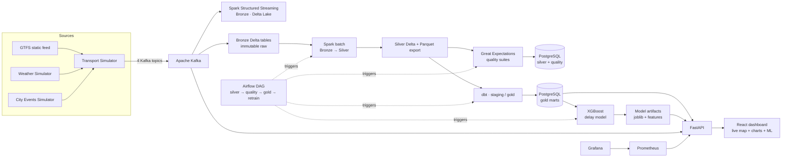

<p align="center">
  
</p>

# Stadtanalyse — Smart Urban Mobility Data Lake & Analytics Platform

A production-style, end-to-end data engineering platform that ingests **real-time transit, weather, and city-event** data, cleanses and organizes it into a **Delta Lake medallion architecture**, runs **data-quality checks**, builds **analytical marts** with **dbt**, retrains an **XGBoost delay-prediction model**, and serves everything through a **FastAPI + React** dashboard — all orchestrated by **Airflow** and monitored with **Prometheus + Grafana**.

> Demo city: **Berlin**. The entire pipeline runs locally with Docker Compose (no cloud credentials needed).

---

## Architecture



## Data flow (medallion architecture)

| Layer | Where | What |
|-------|-------|------|
| **Bronze** | Spark Structured Streaming → Delta Lake on MinIO | Immutable raw records from 4 Kafka topics: `raw.transport.vehicle.positions`, `raw.transport.trip.updates`, `raw.weather.observations`, `raw.city.events` |
| **Silver** | Spark batch ETL | Dedup, bounds/sanity filtering, type casting, `dqr_*` data-quality flags; exported to Delta + Parquet (MinIO) and loaded to PostgreSQL `silver` schema |
| **Quality** | Great Expectations | Versioned suites (one per table) run against the Silver exports; results published to `quality.quality_runs` |
| **Gold** | dbt | Staging views → dims/facts → marts: `route_reliability`, `delay_trends`, `congestion_hotspots`, `weather_impact`, `events_impact`, `ml_features` |
| **Serve** | FastAPI + React | `/api/v1` reads gold marts (falls back to live-stream memory aggregations so the demo is never empty); the ML endpoint serves the trained model |

## Repository layout

```
├── ingest/               data simulators + Kafka producer (Docker)
│   ├── simulator/        transport / weather / city-events simulators
│   └── producer/         Kafka sink, run entrypoint
├── processing/spark/     Spark jobs + image (Delta Lake, S3A, JDBC)
├── quality/              Great Expectations suites + runner
├── dbt/                  dbt project (staging → gold marts) + profiles
├── ml/                   XGBoost delay-model training + artifacts
├── api/                  FastAPI service (warehouse + live stream + ML)
├── web/                  React dashboard (Vite + Leaflet + Recharts)
├── airflow/dags/         batch-pipeline orchestration DAG
├── monitoring/           Prometheus config + Grafana provisioning
├── db/init/              PostgreSQL schema bootstrap
├── scripts/              GTFS static-feed generator
└── data/                 city profile, GTFS feed, local DuckDB snapshot
```

## Quick start

### 0. Prerequisites
- Docker Desktop (macOS) with **at least 4 GB memory** allocated
- Python 3.11+ for the optional local-only path

### 1. Full platform (recommended)

```bash
cp .env.example .env        # optional, sensible defaults are baked in
make up                     # builds & starts the whole stack
```

| Service | URL | Credentials |
|---------|-----|-------------|
| Web dashboard | http://localhost:3000 | — |
| API docs (Swagger) | http://localhost:8000/docs | — |
| Airflow | http://localhost:8080 | admin / admin |
| Grafana | http://localhost:3001 | admin / admin |
| Kafka UI | http://localhost:8081 | — |
| MinIO console | http://localhost:9001 | stadtanalyse / stadtanalyse-secret |

### 2. Generate & inject demo data

```bash
make seed     # generate GTFS feed + local DuckDB snapshot
make ingest   # start the simulators producing to Kafka (streaming)
```

### 3. Run the batch pipeline (once)

```bash
make jobs     # spark-run (silver) → quality (GE) → dbt (gold) → ml-train
```

Or trigger the equivalent DAG from Airflow (`stadtanalyse_batch_pipeline`, every 15 min).
The `spark-streaming` service continuously consumes Kafka into Bronze; the API streams live positions to the dashboard over Server-Sent Events.

### 4. Local-only development (no Docker)

```bash
python3 -m venv .venv
.venv/bin/pip install -r ml/requirements.txt -r api/requirements.txt \
  -r ingest/requirements.txt
make seed
make api-local              # http://localhost:8000
make web-local              # http://localhost:5173 (proxies /api to :8000)
```

Without Kafka/Postgres the API automatically seeds from the local DuckDB snapshot and serves live-stream analytics from memory — perfect for iterating on the UI or the model.

## Batch pipeline detail

`silver → quality → gold → retrain` is expressed both as a Makefile target (`make jobs`) and as an Airflow DAG (`airflow/dags/stadtanalyse_batch_pipeline.py`). Airflow runs each step in its own container (the same compose-built images) attached to the `stadtanalyse_default` network via the Docker daemon socket.

## ML: delay prediction

`ml/train/train_delay_model.py` trains two artifacts from the `gold.ml_features` table:

- **Regressor** — predicted delay in seconds (R² metric)
- **Classifier** — `on_time` / `delayed` / `severe` bucket with probabilities

Features include route mode, weather condition, rush-hour flag, segment length, event proximity, and historical average delay. The API serves both models at `POST /api/v1/ml/predict`; the dashboard includes a live prediction panel.

## Observability

- **Prometheus** scrapes the API (`/metrics`: request rate, latency histograms, ingest counters), Kafka, Postgres, and node exporters.
- **Grafana** auto-provisions the **Stadtanalyse Platform** dashboard on first start.
- **Monitoring API**: `GET /api/v1/monitoring/pipeline` and `GET /api/v1/monitoring/quality` give a runtime view of ingestion, warehouse mode, and the last quality run.

## API surface (abridged)

`/api/v1/kpis` · `/api/v1/live/snapshot` · `/api/v1/live/positions/stream` (SSE) · `/api/v1/delays/{current,top-routes,trends}` · `/api/v1/hotspots` · `/api/v1/routes/reliability` · `/api/v1/weather/{current,impact}` · `/api/v1/events/{active,impact}` · `/api/v1/monitoring/{pipeline,quality}` · `/api/v1/ml/{info,predict}` · `/metrics`

## Possible extensions

- Swap the simulators for real GTFS-RT feeds / Open-Meteo (URLs + key hooks already in `.env.example`)
- Deploy the same pipeline to a real cloud stack (Amazon MSK → EMR/Glue on S3 → Redshift) — the S3A/Delta/JDBC code paths are already cloud-ready
- Add `dbt` tests as hard gates in the Airflow DAG, or add a lineage UI (e.g. datahub/OpenLineage)
