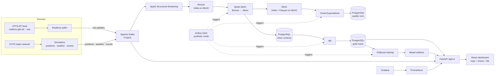

<p align="center">
  
</p>

# Stadtanalyse — Smart Urban Mobility Data Lake & Analytics Platform

An end-to-end data engineering platform for public-transport delays. It streams **real GTFS-RT trip delays** plus **simulated vehicle positions, weather and city events** through Kafka, lands them in a **Delta Lake (Bronze/Silver) on MinIO**, runs **Great Expectations** checks, builds **Gold marts in PostgreSQL with dbt**, trains an **XGBoost delay model**, and serves everything through a **FastAPI + React** dashboard. Batch steps are orchestrated by **Airflow**, and the stack is monitored with **Prometheus + Grafana**.

The platform runs in two modes:

- **Real data** (`make up-real`), demo city **Berlin**. The real [gtfs.de](https://www.gtfs.de) national GTFS network plus **live GTFS-RT trip delays** from `realtime.gtfs.de` flow through Kafka → Bronze → Silver → quality → Gold → the XGBoost model. Vehicle *positions*, weather and events are simulated. GTFS-RT exposes trip delays, not GPS positions, and there is no external weather or events feed. The UI labels the data source accordingly.
- **Fully synthetic** (`make up`): a self-contained demo with a simulated network, positions, delays, weather and events, plus the full Airflow cluster. No real feeds needed.

Everything runs locally with Docker Compose (no cloud credentials).

---

## Data sources

| Kafka topic | Source | Real? |
|-------------|--------|-------|
| `raw.transport.trip.updates` | `make up-real`: GTFS-RT TripUpdates from `realtime.gtfs.de/realtime-free.pb`, **polled every 20 s**, filtered to the city's stops (up to 600 trips per poll). `make up`: simulator | Real in `up-real` mode only |
| `raw.transport.vehicle.positions` | Simulator: vehicles moved along the GTFS network | Simulated |
| `raw.weather.observations` | Simulator: seasonal + diurnal model per weather zone | Simulated |
| `raw.city.events` | Simulator: templated concerts, markets, matches, … | Simulated |

So there is **one real feed plus three simulators**. The weather- and event-impact analytics show how the pipeline joins those streams. They don't measure real-world effects.

## Architecture


```mermaid
flowchart LR
    subgraph Sources
        RT[GTFS-RT feed<br/>realtime.gtfs.de · real] --> P[Realtime poller]
        G[GTFS static network] --> S[Simulators<br/>positions · weather · events]
    end

    P -- "trip updates" --> K[Apache Kafka<br/>4 topics]
    S -- "positions · weather · events" --> K
    K --> SS[Spark Structured Streaming]
    SS --> B[Bronze<br/>Delta on MinIO]

    B --> SB[Spark batch<br/>Bronze → Silver]
    SB --> SL[Silver<br/>Delta + Parquet on MinIO]
    SB --> PGS[(PostgreSQL<br/>silver schema)]
    SL --> GE[Great Expectations]
    GE --> Q[(PostgreSQL<br/>quality runs)]

    PGS --> DBT[dbt]
    DBT --> GOLD[(PostgreSQL<br/>gold marts)]
    GOLD --> ML[XGBoost training]
    ML --> M[Model artifacts]

    GOLD --> API[FastAPI /api/v1]
    M --> API
    K --> API
    API --> UI[React dashboard<br/>map + charts + ML]

    AIR[Airflow DAG<br/>synthetic mode] -. triggers .-> SB
    AIR -. triggers .-> GE
    AIR -. triggers .-> DBT
    AIR -. triggers .-> ML

    PROM[Prometheus] --> API
    GRAF[Grafana] --> PROM
```

## Data flow (medallion architecture)

| Layer | Where | What |
|-------|-------|------|
| **Bronze** | Spark Structured Streaming → **Delta Lake on MinIO** | Append-only raw records from the 4 Kafka topics, parsed against fixed schemas (10 s micro-batches) |
| **Silver** | Spark **batch** ETL → **Delta + Parquet on MinIO**, copied to PostgreSQL `silver` | Dedup, bounds/sanity filtering, type casting, `dqr_*` data-quality flags. Rebuilt from all of Bronze on each run (not incremental) |
| **Quality** | Great Expectations | Versioned suites (one per table) run against the Silver Parquet exports; results go to `quality.quality_runs`. A failing suite stops the batch run |
| **Gold** | dbt → **PostgreSQL** `gold` schema | Raw GTFS views (`gold_silver`) → staging views → dims/facts → marts: `route_reliability`, `delay_trends`, `congestion_hotspots`, `weather_impact`, `events_impact`, `ml_features` |
| **Serve** | FastAPI + React | `/api/v1` reads the Gold marts (falls back to in-memory aggregates of the live stream if Postgres is unavailable); the ML endpoint serves the trained model |

Bronze and Silver are Delta tables on MinIO. Gold is a set of PostgreSQL tables built by dbt, not Delta.

## Repository layout

```
├── ingest/               data simulators + Kafka producer (Docker)
│   ├── simulator/        transport / weather / city-events simulators
│   ├── realtime/         real GTFS + GTFS-RT download, extract & poller (real mode)
│   └── producer/         Kafka sink, run entrypoint
├── processing/spark/     Spark jobs + image (Delta Lake, S3A, JDBC)
├── quality/              Great Expectations suites + runner
├── dbt/                  dbt project (raw → staging → gold marts) + profiles
├── ml/                   XGBoost delay-model training + artifacts
├── api/                  FastAPI service (warehouse + live stream + ML)
├── web/                  React dashboard (Vite + Leaflet + Recharts)
├── airflow/dags/         batch-pipeline orchestration DAG (synthetic mode only)
├── monitoring/           Prometheus config + Grafana provisioning
├── db/init/              PostgreSQL schema bootstrap
├── deploy/               public demo server (nginx + systemd, snapshot mode)
├── scripts/              GTFS generator; snowflake_experiment/ (unfinished, see its README)
└── data/                 city profile, GTFS static feed, local DuckDB snapshot
```

## Quick start

### 0. Prerequisites
- Docker Desktop with **8 GB+ memory** allocated. The full stack is ~20 containers, including Kafka, Spark, Airflow and Grafana.
- **Python 3.11+** for the local helper commands (`make seed`, local dev)

### 1a. Real-data platform (recommended, demo Berlin)

```bash
cp .env.example .env        # optional, sensible defaults are baked in
make up-real                # builds & starts the real-data stack (no Airflow)
make jobs                   # once: GTFS static → silver → quality → gold → ml-train
```

`make up-real` starts Kafka, MinIO, Spark (streaming + jobs in `local[4]` mode), PostgreSQL, the API and the web dashboard. It also starts the `realtime` service, which downloads the national GTFS feed, extracts the Berlin network, and polls the live GTFS-RT delay feed **every 20 seconds**. The first start takes a while because the national feed is large.

`make jobs` runs the batch pipeline **sequentially** (concurrent runs race):
1. **GTFS static load**: `load_gtfs_static.py` imports the real Berlin network (`stops` 15 000+, `stop_times` ~3.9 M, `routes`, `trips`) into Postgres `gtfs_raw`.
2. **Bronze → Silver**: Spark batch ETL on the live-ingested records.
3. **Quality**: Great Expectations suites against the Silver exports.
4. **dbt**: builds `gold_silver` raw views → staging → Gold marts.
5. **ml-train**: trains the XGBoost delay model on `gold.ml_features` and saves artifacts to the `ml_artifacts` volume the API serves.

### 1b. Full platform (synthetic, with Airflow)

Generate the synthetic GTFS network **before** starting the producers. `make seed` uses a local virtualenv:

```bash
python3.11 -m venv .venv
.venv/bin/pip install -r ingest/requirements.txt
make seed                   # generate GTFS feed + local DuckDB snapshot (run before make ingest)

cp .env.example .env        # optional, sensible defaults are baked in
make up                     # builds & starts the whole stack
make ingest                 # start the simulators producing to Kafka
```

| Service | URL | Credentials |
|---------|-----|-------------|
| Web dashboard | http://localhost:3000 | — |
| API docs (Swagger) | http://localhost:8000/docs | — |
| Airflow | http://localhost:8080 | admin / admin |
| Grafana | http://localhost:3001 | admin / admin |
| Kafka UI | http://localhost:8081 | — |
| MinIO console | http://localhost:9001 | stadtanalyse / stadtanalyse-secret |

These are local development defaults. All ports bind to every interface, so don't run this compose file on a public host as-is.

Real mode needs no seeding: the `realtime` service downloads and installs the real feed on first start (the data-source badge on the dashboard shows **REAL GTFS-RT DELAYS**).

### 2. Run the batch pipeline (once)

```bash
make jobs     # spark-run (silver) → quality (GE) → dbt (gold) → ml-train
```

Or trigger the equivalent DAG from Airflow (`stadtanalyse_batch_pipeline`, every 15 min, synthetic mode). The `spark-streaming` service continuously consumes Kafka into Bronze, and the API streams live positions to the dashboard over Server-Sent Events.

### 3. Local-only development (no Docker)

```bash
python3.11 -m venv .venv
.venv/bin/pip install -r api/requirements.txt -r ingest/requirements.txt
make seed
make api-local              # http://localhost:8000
make web-local              # http://localhost:5173 (proxies /api to :8000)
```

Without Kafka/Postgres the API seeds itself from the local DuckDB snapshot and serves analytics from memory, which is handy for iterating on the UI.

## Batch pipeline detail

`silver → quality → gold → retrain` is expressed as a Makefile target (`make jobs`) and, in the full synthetic mode, as an Airflow DAG (`airflow/dags/stadtanalyse_batch_pipeline.py`) that runs each step as a Docker container. In real mode the steps run sequentially via `docker compose --profile jobs run --rm`, and `spark-streaming` runs in `local[4]` mode (no cluster), continuously consuming Kafka into Bronze.

## ML: delay prediction

`ml/train/train_delay_model.py` (run via `processing/spark/scripts/run_train.sh`) trains on the `gold.ml_features` table:

- **Regressor**: predicted delay in seconds
- **Classifier**: `on_time` (≤ 2 min) / `delayed` (≤ 10 min) / `severe` bucket, with probabilities

Features: route mode, weather condition, hour, day of week, rush-hour flag, segment length, event proximity, and the historical average delay of the route + stop.

Evaluation is set up to avoid the usual time-series traps:
- **Time-based split**: rows sorted by `event_ts`, last 20% held out as the test set.
- **No target leakage**: `historical_avg_delay` is recomputed from the training window only, so test rows never contribute to it.
- **Baselines**: MAE is reported next to two baselines, the training mean and the training route + stop median. The classifier is compared with a majority-class baseline.
- **Classifier metrics**: macro-F1 and per-class recall, not just accuracy.
- **Missing weather** is filled with the training median.

All of this is written to `metrics.json` next to the model. Weather and event features come from simulators, so don't expect them to carry real signal.

The API serves both models at `POST /api/v1/ml/predict`, and the dashboard has a prediction panel. Model artifacts live in the `ml_artifacts` volume, which the API mounts at `/opt/ml/model`.

## Observability

Full local stack only:

- **Prometheus** scrapes the API (`/metrics`: request rate, latency histograms, ingest counters) plus the Kafka, Postgres and node exporters.
- **Grafana** auto-provisions the **Stadtanalyse Platform** dashboard on first start.
- **Monitoring API**: `GET /api/v1/monitoring/pipeline` and `GET /api/v1/monitoring/quality` give a runtime view of ingestion, warehouse mode, and the last quality run.

## Live demo

[stadtanalyse.srikarkodi.dev](https://stadtanalyse.srikarkodi.dev) runs in **snapshot mode** on a small server (`deploy/`: nginx + systemd, no Docker). The API serves a fixed, **synthetic** DuckDB snapshot from memory (`API_MEMORY_MODE=1`). **There is no Kafka, Spark, MinIO, Postgres, Airflow, Grafana or ML model on the server**, so the map doesn't move and the delay predictor and city switcher are disabled. The dashboard labels this as "DEMO SNAPSHOT (synthetic data)" and shows "Demo API offline" if the backend is down. To see the real pipeline, run `make up-real` locally.

## API surface (abridged)

`/api/v1/kpis` · `/api/v1/data-source` · `/api/v1/live/snapshot` · `/api/v1/live/positions/stream` (SSE) · `/api/v1/delays/{current,top-routes,trends}` · `/api/v1/hotspots` · `/api/v1/routes/reliability` · `/api/v1/weather/{current,impact}` · `/api/v1/events/{active,impact}` · `/api/v1/monitoring/{pipeline,quality}` · `/api/v1/ml/{info,predict}` · `/metrics`

## Known limitations

- **Only trip delays are real.** Vehicle positions, weather and events are simulated, so weather/event impact marts and features don't reflect the real world.
- **Duplicate observations.** The GTFS-RT poller re-sends every in-city trip each poll with the ingestion time as `event_ts`, so Silver's dedup doesn't collapse repeats of the same trip.
- **Time zones.** Timestamps are UTC end to end; hour-of-day and rush-hour features are not converted to Europe/Berlin.
- **Silver is a full rebuild** of Bronze on every run, and only up to 200k rows per table are copied to Postgres.
- **The model is weak.** It's trained on a small window of data with mostly simulated context features; check `metrics.json` against the baselines before trusting a prediction. The API loads the model once at startup, so a retrained model is picked up only after an API restart.
- **No automated tests or CI.** dbt tests exist but `dbt run` (not `dbt build`) is what the pipeline executes. There is no alerting on top of Prometheus.
- **Airflow only in synthetic mode.** The recommended real-data mode runs the batch steps with `make jobs`.
- **Local-dev security defaults.** Default passwords, a committed Airflow Fernet key, and the Docker socket mounted into Airflow.

## Possible extensions

- Extend real mode to more cities (Hamburg, München, … are already in `data/cities.json`; the GTFS loader + batch job take the city from `data/gtfs/.city`)
- Add GTFS-RT VehiclePosition support to real mode if a feed starts publishing GPS positions (currently GTFS-RT exposes only TripUpdates + ServiceAlerts)
- Replace the weather simulator with a real source (e.g. Open-Meteo)
- Deploy the same pipeline to a real cloud stack (Amazon MSK → EMR/Glue on S3 → Redshift); the S3A/Delta/JDBC code paths are already cloud-ready
- Add `dbt` tests as hard gates in the Airflow DAG, or add a lineage UI (e.g. datahub/OpenLineage)
